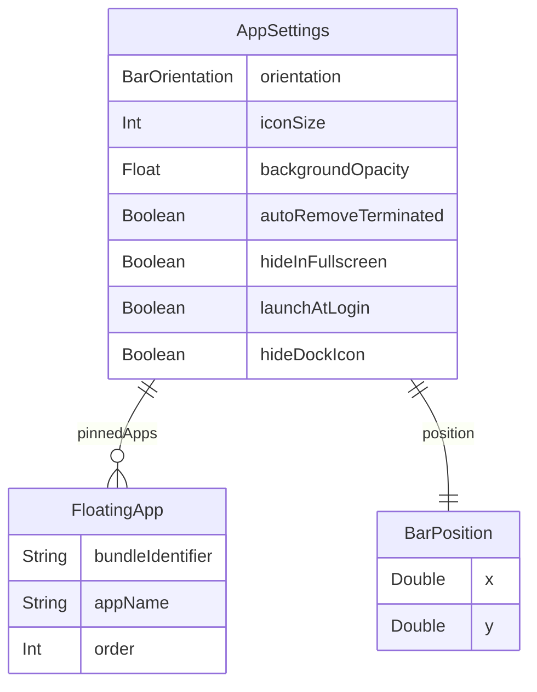

데이터 정의 — FloatMe       
   
 
 

# FloatMe 데이터 정의
 
내부 데이터 모델 · v0.1 · 2026-04-17
 
 
 FloatMe는 네이티브 macOS 앱으로 REST API 없이 내부 데이터 모델만 정의한다. 모든 데이터는 UserDefaults에 Codable JSON으로 저장된다. 
  
 

## 데이터 모델
 
 
 
 
3
 
Struct
 
 
 
2
 
Enum
 
 
 
11
 
Fields
 
 
  
 

## ER 다이어그램
 
 
 

 
  
 

## FloatingApp
 
 
플로팅 바에 고정된 개별 앱 정보. Bundle Identifier로 앱을 식별한다.
   
 bundleIdentifier"com.apple.dt.Xcode" appName"Xcode" order0 
 
| 필드 | 타입 | 필수 | 설명 | 예시 |
|------|------|------|------|------|
| String | Y | 앱 고유 식별자 (macOS Bundle ID) |  |  |
| String | Y | 앱 표시명 (저장 시점 캐시) |  |  |
| Int | Y | 플로팅 바 내 표시 순서 (0부터) |  |  |

  
 

## AppSettings
 
 
사용자 설정 전체를 담는 루트 모델. UserDefaults에 단일 JSON으로 저장.
   
 pinnedApps position orientation iconSize backgroundOpacity autoRemoveTerminated hideInFullscreen launchAtLogin hideDockIcon 
 
| 필드 | 타입 | 기본값 | 설명 |
|------|------|------|------|
| [FloatingApp] | [] | 플로팅에 고정된 앱 목록 (순서 보장) |  |
| BarPosition | {100, 100} | 플로팅 바 좌상단 좌표 |  |
| BarOrientation | .horizontal | 배치 방향 |  |
| Int | 36 | 아이콘 크기 (px, 24~48 범위) |  |
| Float | 0.8 | 플로팅 바 배경 투명도 (0.5~1.0) |  |
| Bool | true | 종료된 앱 자동 제거 여부 |  |
| Bool | true | 전체화면 Space에서 숨김 여부 |  |
| Bool | false | 로그인 시 자동 시작 |  |
| Bool | false | Dock 아이콘 숨김 (메뉴바 전용 모드) |  |

  
 

## BarPosition
 
 
플로팅 바의 화면 좌표. 드래그 종료 시 저장.
   
 x y 
 
| 필드 | 타입 | 설명 |
|------|------|------|
| Double | 화면 좌상단 기준 X 좌표 (pt) |  |
| Double | 화면 좌상단 기준 Y 좌표 (pt) |  |

  
 

## Enum 정의
 
 

### BarOrientation
   
 .horizontal .vertical 
 
| Case | Raw Value | 설명 |
|------|------|------|
| "horizontal" | 가로 배치 (좌→우) |  |
| "vertical" | 세로 배치 (위→아래) |  |

 

### AppState (런타임 전용, 비저장)
   
 .running .terminated .active 
 
| Case | 설명 |
|------|------|
| 앱이 실행 중 — 아이콘 정상 표시 |  |
| 앱이 종료됨 — 흐리게 표시 또는 제거 |  |
| 현재 포커스된 앱 — 하이라이트 표시 |  |