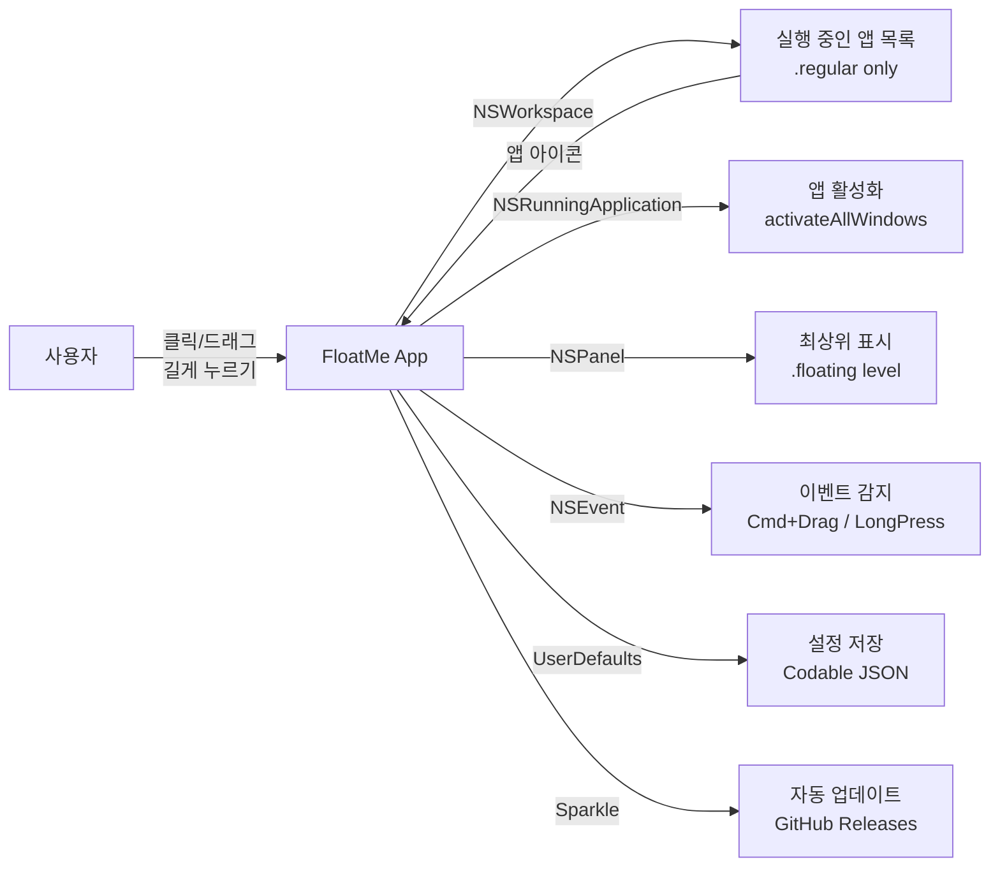
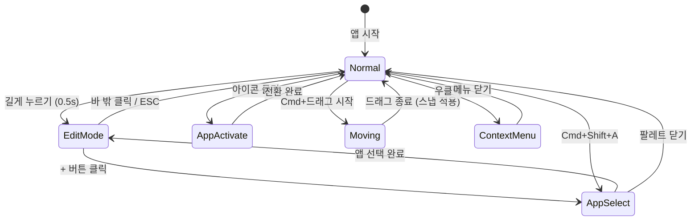

PRD — FloatMe       
   
  
 

# FloatMe
 
macOS Floating App Switcher
 
 v0.1 Draft macOS 15+ MIT License DMG 2026-04-17 
 
  
 

## 1. Product Overview
 
 
 FloatMe는 macOS에서 실행 중인 앱들을 작은 플로팅 아이콘으로 화면 위에 항상 띄워두고, 클릭 한 번으로 해당 앱을 최상단으로 전환할 수 있는 앱 전환 유틸리티이다. 
 
 macOS Dock과 달리 화면 위 어디든 자유롭게 배치할 수 있으며, 실행 중인 앱만 대상으로 하여 실시간으로 추가/제거가 가능하다. 아이콘은 가로 또는 세로로 일렬 나열되며, 접히거나 펼쳐지지 않는 고정 레이아웃을 제공한다. 앱이 많아지면 아이콘이 자동으로 축소되어 화면 안에 맞춰진다. 
 
 

#### 핵심 가치
   
 즉시 전환 시각적 접근 비침해적 편집 모드 
 
| 가치 | 설명 |
|------|------|
| Cmd+Tab 없이 시각적으로 원하는 앱을 클릭 한 번에 전환 |  |
| 앱 아이콘을 직접 보며 전환 — 이름이 아닌 시각 기반 |  |
| Dock 위치/크기를 변경하지 않고 독립적으로 동작 |  |
| iOS처럼 길게 누르면 편집 모드 — 추가/제거/정렬을 하나의 UX로 |  |

 
  
 

## 2. Target Users
 
 
 
 

#### 멀티태스커
 
 동시에 5개 이상의 앱을 사용하며, Cmd+Tab 목록이 길어져 원하는 앱을 찾기 어려운 사용자. 주로 개발자, 디자이너, 기획자. 
 
 
 

#### 워크플로우 중심 사용자
 
 특정 앱 세트를 빈번하게 전환하며 작업하는 사용자. 예: 코드 에디터 + 터미널 + 브라우저 + Slack. 
 
 
 

#### 마우스 선호 사용자
 
 키보드 단축키보다 마우스 클릭으로 앱을 전환하는 것을 선호하는 사용자. Dock이 자동 숨김이거나 외부 모니터 환경에서 Dock 접근이 불편한 경우. 
 
 
  
 

## 3. System Context
 
 
 

 
  
 

## 4. Tech Stack
 
   
 Swift 5.9+ SwiftUIAppKit NSPanel NSWorkspace NSRunningApplication NSVisualEffectView UserDefaults + Codable Sparkle DMG + Notarization MIT 
 
| 레이어 | 기술 | 용도 |
|------|------|------|
| Language | 앱 전체 구현 |  |
| UI Framework | + | 설정 UI(SwiftUI) + 플로팅 윈도우(AppKit NSPanel) |
| Floating Window | 항상 최상위, nonactivatingPanel, canBecomeKey 제어 |  |
| App Detection | 실행 중인 앱 목록 감시 (Notification 기반) |  |
| App Activation | 앱 활성화 (activateAllWindows) |  |
| Visual Effect | 블러 배경 (기본 스타일) |  |
| Storage | 설정, 고정 앱 목록, 위치 저장 |  |
| Auto Update | 인앱 자동 업데이트 (appcast.xml) |  |
| Distribution | GitHub Releases로 배포 |  |
| License | 오픈소스 |  |

  
 

## 5. Requirements
 
 
 
 
FR-01
 

#### 플로팅 바 표시
 
선택한 앱들의 아이콘을 가로/세로 일렬로 화면 위에 항상 최상위 표시. 앱 수 증가 시 자동 크기 축소(최소 20px). 배경 스타일은 사용자 선택(블러/다크/투명).
 
 
 
FR-02
 

#### 앱 전환 (클릭)
 
플로팅 아이콘 클릭 시 해당 앱의 모든 윈도우를 최상단으로 올리고 포커스 전환. 200ms 디바운스.
 
 
 
FR-03
 

#### 편집 모드 (Long Press)
 
0.5초 길게 누르면 편집 모드 진입. 아이콘 흔들림 + X 제거 버튼 + 추가(+) 버튼 + 드래그 정렬. 바 밖 클릭 또는 ESC로 종료.
 
 
 
FR-04
 

#### 앱 추가 (3가지)
 
편집 모드 + 버튼, 메뉴바 "앱 추가", 글로벌 핫키(Cmd+Shift+A)로 앱 선택 팔레트 열기. 실행 중인 .regular 앱만 표시.
 
 
 
FR-05
 

#### 앱 제거 (4가지)
 
편집 모드 X 버튼, 우클릭 메뉴, Option+클릭 즉시 제거, 팔레트 토글. 앱 종료 시 자동 제거.
 
 
 
FR-06
 

#### 플로팅 바 이동
 
Cmd+드래그로 바 전체 이동. 화면 가장자리 스냅(20px 이내). Shift로 스냅 무시. 다중 모니터 간 자유 이동.
 
 
 
FR-07
 

#### 실행 중인 앱 감시
 
NSWorkspace Notification으로 앱 실행/종료 실시간 감지. 종료된 앱은 플로팅에서 자동 제거.
 
 
 
FR-08
 

#### 메뉴바 아이콘
 
메뉴바 상주. 플로팅 표시/숨김(Cmd+Shift+F), 방향 전환, 앱 추가, 환경설정, 종료.
 
 
 
FR-09
 

#### 설정 유지 & 자동 업데이트
 
앱 목록/위치/방향/크기/배경 스타일을 UserDefaults에 저장. Sparkle으로 자동 업데이트.
 
 
  
 

## 6. Interaction Model
 
   
 클릭 우클릭 Option+클릭 길게 누르기 (0.5초) Cmd+드래그 Cmd+Shift+F Cmd+Shift+A 
 
| 입력 | 대상 | 동작 |
|------|------|------|
| 플로팅 아이콘 | 해당 앱의 모든 윈도우 최상단 활성화 |  |
| 플로팅 아이콘 | 컨텍스트 메뉴 (제거, 앱 정보) |  |
| 플로팅 아이콘 | 즉시 제거 |  |
| 플로팅 바 | 편집 모드 진입 |  |
| 플로팅 바 | 바 전체 이동 (스냅 적용) |  |
| 글로벌 | 플로팅 바 표시/숨김 토글 |  |
| 글로벌 | 앱 선택 팔레트 열기 |  |

 
 

 
  
 

## 7. Edit Mode (편집 모드)
 
 
iOS 홈화면과 유사한 편집 모드. 길게 누르면 진입하여 추가/제거/정렬을 하나의 통합 UX로 제공한다.
 
 일반 모드:
 [ Xc ] [ Sa ] [ Fi ] [ Sl ] ← 클릭 = 앱 전환

 편집 모드 (길게 누른 후):
  × × × ×
 [Xc~] [Sa~] [Fi~] [Sl~] [+]
  ~ = 흔들림 × = 제거 [+] = 추가 
   
    
- X 버튼 클릭 → 아이콘 제거
 
- + 버튼 클릭 → 앱 선택 팔레트
 
- 아이콘 드래그 → 순서 변경
 
   
 
| 진입 조건 | 가능한 동작 | 종료 조건 |  |
|------|------|------|------|
| 아이콘 0.5초 이상 길게 누르기 |  |  | 바 밖 영역 클릭 / ESC 키 |

  
 

## 8. Visual Design
 
 

### 배경 스타일 (사용자 선택)
   
 블러 (시스템)   
 
| 스타일 | 설명 | 기본값 |
|------|------|------|
| NSVisualEffectView — Dock/메뉴바와 동일한 반투명 블러 | 기본값 |  |
| 다크 | 불투명 어두운 배경 (#222, 80%) |  |
| 투명 | 배경 없이 아이콘만 표시 |  |

 
투명도 슬라이더: 50% ~ 100%
 

### 활성 앱 표시: 도트 + 테두리 병행
 
  [Xc] ┌[Sa]┐ [Fi] [Sl]
  ● └ ● ─┘ ●
  run focused run 
  
- 하단 도트 (●): 실행 중인 앱 표시 (Dock 스타일)
 
- 테두리 하이라이트: 현재 포커스된 앱에 파란 테두리 (2px ring)
 
 

### 호버: 툴팁만
 
마우스 호버 시 앱 이름 툴팁 표시. 아이콘 확대/마그니피케이션 없음.
 

### 애니메이션
  
- 추가 시: 페이드인 + 슬라이드
 
- 제거 시: 축소 + 페이드아웃
 
- 편집 모드: 아이콘 흔들림 (iOS 위글)
 
  
 

## 9. Constraints & Limitations
 
   
        
 
| 항목 | 제약/한계 | 대응 |
|------|------|------|
| 최소 OS | macOS 15 (Sequoia) 이상 | 최신 SwiftUI Observable, Menu API 활용 |
| 앱 필터 | .regular 앱만 (백그라운드/데몬 제외) | activationPolicy 필터 |
| 자기 자신 | FloatMe는 앱 목록에서 숨김 | bundleIdentifier 필터 |
| 전체화면 | 전체화면 Space에서 플로팅 제한 | 설정에서 자동 숨김 옵션 |
| 아이콘 최소 크기 | 자동 축소 최소 20px | 20px 이하로 줄이지 않음 |
| App Sandbox | DMG 배포로 샌드박스 미적용 | Notarization 필수 |
| 다중 모니터 | 하나의 바만 지원 | 모니터 간 Cmd+드래그 이동 |

  
 

## 10. Future (v0.2)
 
 
 
v0.2 예약 기능
  
- 키보드 단축키: Ctrl+1~9로 플로팅 앱 전환, 사용자 지정 핫키
 
- 모니터별 독립 플로팅 바: 각 모니터에 별도 바와 앱 세트
 
- 앱 그룹: 여러 앱을 하나의 그룹으로 묶어 한 번에 전환
 
- 프로필: 작업 컨텍스트별 앱 세트 프로필 저장/전환
 
- 테마: 다크/라이트 자동 전환, 커스텀 색상
 
- AppleScript/Shortcuts 연동