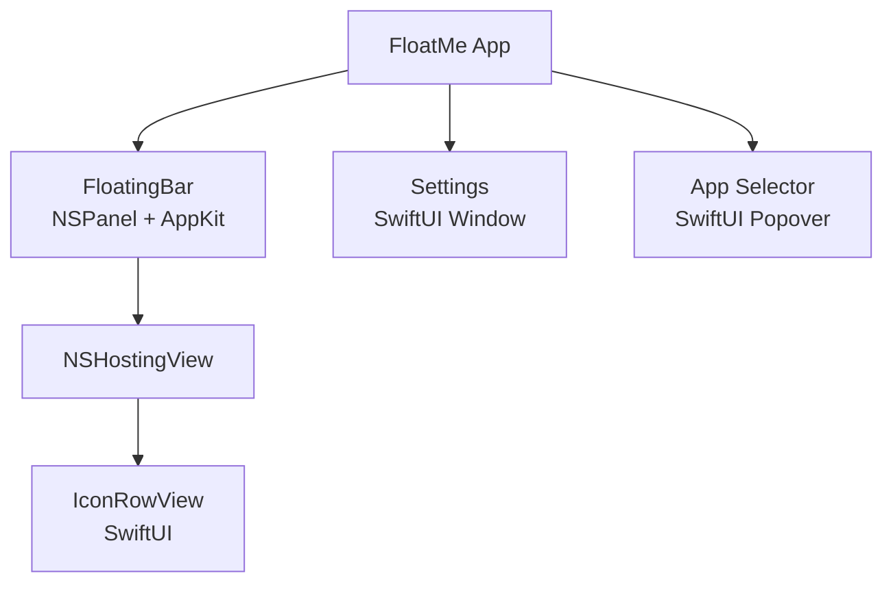
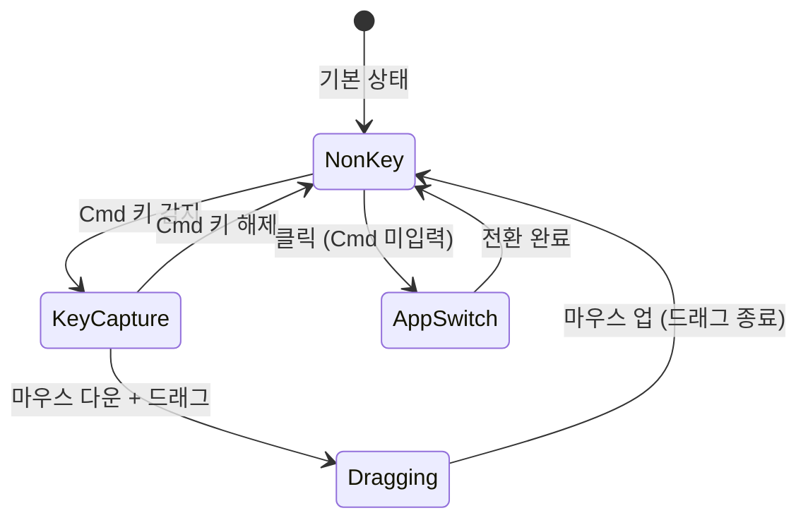
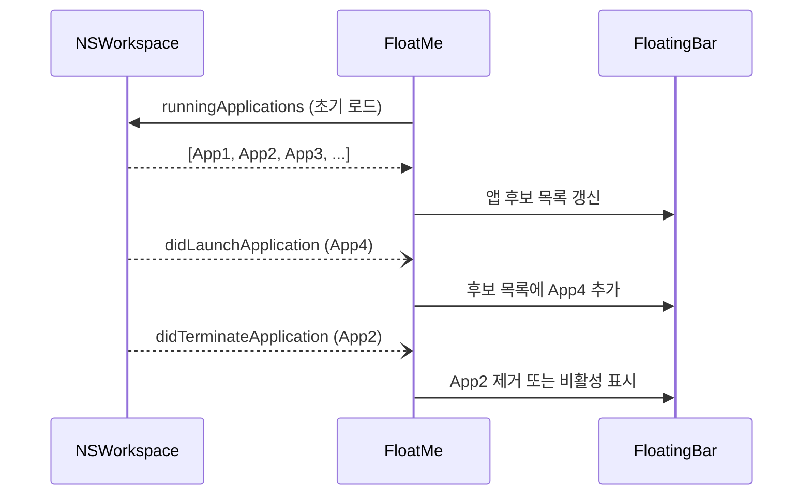

기술백서 (ADR) — FloatMe       
   
 
 

# FloatMe 기술백서 (ADR)
 
v0.1 · 2026-04-17 · Draft
 
 
  All Accepted Proposed 
  
 
 
 ADR-001 

### UI 프레임워크 선택: SwiftUI + AppKit Hybrid
 
 Accepted 
 
 
 

#### 컨텍스트
 
FloatMe는 두 가지 성격의 UI가 필요하다:
  
- 플로팅 윈도우: 항상 최상위에 떠 있어야 하며, NSWindow.Level 제어, 마우스 이벤트 정밀 처리(Cmd+드래그), 배경 투명, 그림자 커스터마이징 등 AppKit의 저수준 윈도우 API에 접근해야 한다.
 
- 설정 화면/팝업: 일반적인 폼 UI(토글, 리스트, 슬라이더 등)로 SwiftUI의 선언적 UI가 적합하다.
 
 
 
 

#### 결정
 
SwiftUI + AppKit Hybrid 방식을 채택한다.
  
- 플로팅 윈도우: NSPanel (AppKit) — 윈도우 레벨, 이벤트 처리, 투명도 직접 제어
 
- 플로팅 바 내부 뷰: NSHostingView로 SwiftUI 뷰를 호스팅
 
- 설정/팝업 UI: 순수 SwiftUI
 
 
 

 
 
 
 

#### 근거
   
    
 
| 결정 사항 | 근거 |
|------|------|
| 플로팅에 AppKit | SwiftUI Window는 .level 제어, 투명 배경, 이벤트 마스킹 등 저수준 커스터마이징이 불가 |
| 설정에 SwiftUI | 폼/리스트 UI는 SwiftUI가 코드량 50% 이상 감소, 라이브 프리뷰 지원 |
| NSHostingView 브릿지 | AppKit 윈도우 안에서 SwiftUI의 선언적 렌더링 활용 가능 |

 
 
 

#### 대안 검토
   
    
 
| 대안 | 검토 결과 |
|------|------|
| 순수 SwiftUI | NSWindow.Level 제어 불가, 플로팅 윈도우 구현에 근본적 한계 |
| 순수 AppKit | 설정 UI 개발 생산성 저하, 코드량 증가 |
| Electron / Web | 리소스 과다 사용, macOS 네이티브 감성 부재, 앱 크기 비대 |

 
 
 

#### 결과
 
 긍정적: 각 UI 특성에 최적화된 프레임워크 사용, 유지보수성과 네이티브 경험 모두 확보 
 
 부정적: 두 프레임워크 간 상태 동기화 복잡성, 학습 곡선 증가 
 
 주의사항: AppKit-SwiftUI 브릿지(NSHostingView/NSViewRepresentable) 성능 오버헤드 모니터링 필요 
 
 
 
  
 
 
 ADR-002 

### 플로팅 윈도우 구현: NSPanel + canBecomeKey 제어
 
 Accepted 
 
 
 

#### 컨텍스트
 
플로팅 바가 화면 위에 떠 있으면서도 다른 앱의 포커스를 빼앗으면 안 된다. 예: 사용자가 텍스트 에디터에 타이핑하는 중에 플로팅 바가 키 포커스를 가져가면 입력이 끊긴다.
 
또한 Cmd+드래그로 이동 시에만 마우스 이벤트를 가로채고, 일반 클릭은 대상 앱 전환으로 처리해야 하는 이중 이벤트 모드가 필요하다.
 
 
 

#### 결정
 
NSPanel(nonactivatingPanel)을 사용하며, canBecomeKey를 상황에 따라 전환한다.
 
 

 
  
- 기본 상태: canBecomeKey = false → 포커스 미획득, 클릭 이벤트만 수신
 
- Cmd 감지 시: canBecomeKey = true → 드래그 이벤트 수신 가능
 
- NSWindow.Level: .floating (일반 윈도우 위, 시스템 알림 아래)
 
- NSPanel 스타일: .nonactivatingPanel + .hudWindow
 
 
 
 

#### 근거
   
     
 
| 결정 사항 | 근거 |
|------|------|
| NSPanel | NSWindow의 서브클래스로, 보조 윈도우에 특화된 동작 내장 (focus 비활성화 등) |
| nonactivatingPanel | 패널이 key window가 되어도 소유 앱을 활성화하지 않음 |
| .floating level | 일반 윈도우보다 위, 시스템 모달보다 아래 — 비침해적 최상위 |
| canBecomeKey 전환 | 드래그 시에만 키 이벤트 수신, 평상시 포커스 간섭 방지 |

 
 
 

#### 대안 검토
   
    
 
| 대안 | 검토 결과 |
|------|------|
| NSWindow + .floating | canBecomeKey 동작이 NSPanel보다 제어 어려움 |
| NSStatusBarButton 커스터마이징 | 메뉴바에만 위치, 자유 배치 불가 |
| CGWindowLevel 직접 제어 | 저수준 API, 관리 복잡도 높음, 샌드박스 호환성 이슈 |

 
 
 

#### 결과
 
 긍정적: 포커스 간섭 없이 항상 최상위 표시, Cmd+드래그와 일반 클릭 자연스럽게 분리 
 
 부정적: canBecomeKey 전환 타이밍 미스 시 일시적 포커스 문제 가능 
 
 
 
  
 
 
 ADR-003 

### 실행 중인 앱 감지: NSWorkspace Notification 기반
 
 Accepted 
 
 
 

#### 컨텍스트
 
플로팅 바에 표시할 앱 후보는 "현재 실행 중인 앱"이어야 한다. 앱이 종료되면 플로팅에서도 반영해야 하며, 새 앱이 실행되면 추가 후보에 나타나야 한다. 이를 위해 앱 실행/종료 이벤트를 실시간으로 감지해야 한다.
 
 
 

#### 결정
 
NSWorkspace.shared.notificationCenter의 알림을 구독한다:
  
- NSWorkspace.didLaunchApplicationNotification — 앱 실행 감지
 
- NSWorkspace.didTerminateApplicationNotification — 앱 종료 감지
 
- NSWorkspace.didActivateApplicationNotification — 앱 활성화 감지 (현재 포커스 앱 추적)
 
 
초기 목록은 NSWorkspace.shared.runningApplications에서 로드하고, 이후 알림으로 증분 갱신한다.
 
 

 
 
 
 

#### 근거
   
    
 
| 결정 사항 | 근거 |
|------|------|
| NSWorkspace Notification | macOS 공식 API, 폴링 불필요, 이벤트 기반 실시간 감지 |
| 초기 로드 + 증분 갱신 | 앱 시작 시 빠른 초기화 + 이후 효율적 갱신 |
| didActivate 추가 구독 | 현재 활성 앱 추적으로 플로팅 아이콘 하이라이트 가능 |

 
 
 

#### 대안 검토
   
   
 
| 대안 | 검토 결과 |
|------|------|
| 타이머 기반 폴링 | CPU 낭비, 지연 발생, 이벤트 누락 가능 |
| Accessibility API | 과도한 권한 요구, 단순 앱 목록 감시에 불필요 |

 
 
 

#### 결과
 
 긍정적: 추가 권한 불필요, 실시간 감지, CPU 오버헤드 거의 없음 
 
 주의사항: 백그라운드 에이전트/데몬 앱은 runningApplications에 포함되나 UI 앱이 아닐 수 있음 — activationPolicy 필터 필요 
 
 
 
  
 
 
 ADR-004 

### 설정 저장: UserDefaults + Codable
 
 Accepted 
 
 
 

#### 컨텍스트
 
FloatMe는 다음 데이터를 영구 저장해야 한다:
  
- 고정된 앱 목록 (Bundle ID 배열)
 
- 플로팅 바 위치 (x, y 좌표)
 
- 레이아웃 방향 (가로/세로)
 
- 아이콘 크기
 
- 기타 사용자 설정
 
 
데이터량이 적고 단일 사용자 환경이므로 DB는 과도하다.
 
 
 

#### 결정
 
UserDefaults + Codable struct 조합을 사용한다.
  
- 설정 모델을 Codable struct로 정의
 
- UserDefaults에 JSON 직렬화하여 저장
 
- @AppStorage 프로퍼티 래퍼로 SwiftUI 바인딩
 
 
 
 

#### 대안 검토
   
    
 
| 대안 | 검토 결과 |
|------|------|
| Core Data | 단순 설정 저장에 과도한 스택, 마이그레이션 복잡성 |
| 파일 직접 쓰기 (JSON) | 동시성 제어 직접 구현 필요, UserDefaults 대비 이점 없음 |
| SwiftData | macOS 14+ 필요, 최소 지원 OS(13) 미달 |

 
 
 

#### 결과
 
 긍정적: 추가 의존성 없음, iCloud 동기화 옵션, SwiftUI 통합 자연스러움 
 
 주의사항: 대용량 데이터 부적합 (설정 수준이므로 문제 없음)